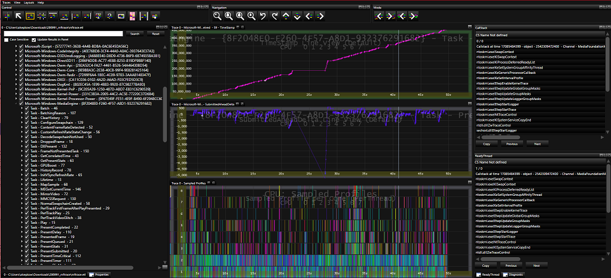

## What is this repo?
A collection of Microsoft Media Foundation sample apps along with tooling and documentation. Our goal is to share code samples, documentation, our favorite tools, and tips and tricks for troubleshooting Media Foundation issues. 

## Samples
- [MediaEngineUWP](https://github.com/microsoft/media-foundation/tree/master/samples/MediaEngineUWPSample) - A sample UWP C++/WinRT application which demonstrates media playback using the MediaFoundation MediaEngine API and the WinRT composition APIs.
- [MediaEngineDCompWin32Sample](https://github.com/microsoft/media-foundation/tree/master/samples/MediaEngineDCompWin32Sample) - A sample native C++ Win32 application which demonstrates media playback using the MediaFoundation MediaEngine API and the DirectComposition API.

## Documentation
- [Media Foundation SDK](https://docs.microsoft.com/en-us/windows/win32/medfound/microsoft-media-foundation-sdk)
- [Media Foundation Programming Guide](https://docs.microsoft.com/en-us/windows/win32/medfound/media-foundation-programming-guide)
- [Media Foundation Programming Reference](https://docs.microsoft.com/en-us/windows/win32/medfound/media-foundation-programming-reference)

## Tracing and Debugging
- [Capturing Media Foundation Traces](https://docs.microsoft.com/en-us/windows/win32/medfound/using-mftrace#interpreting-the-trace-results) 
- [Identifying Video Rendering Related Issues](./performanceTracing/README.md)

## Microsoft Tools
1. [Media Experience Analyzer]() (MXA) - An advanced analysis tool used by Media experts to analyze Media Foundation performance traces.
    - Available for download [here](https://www.microsoft.com/en-us/download/details.aspx?id=43105)
    - [MXA Getting Started pdf](https://www.microsoft.com/en-us/download/details.aspx?id=43105)
    - Microsofts Channel9 has produced a series of training videos for MXA available [here](./MXAVideoList.md)

    

2. [GPUView](https://docs.microsoft.com/en-us/windows-hardware/drivers/display/using-gpuview) - A development tool for determining the performance of the graphics processing unit (GPU) and CPU. It looks at performance with regard to direct memory access (DMA) buffer processing and all other video processing on the video hardware.
    - Available in the [Windows SDK](https://developer.microsoft.com/en-US/windows/downloads/windows-10-sdk/)
    - Also available in the [Windows Performance Toolkit](https://docs.microsoft.com/en-us/windows-hardware/test/wpt/)

    

3. [TopoEdit](https://docs.microsoft.com/en-us/windows/win32/medfound/topoedit) - A visual tool for building and testing Media Foundation topologies.

    

## Other useful links
- [Book: Developing Microsoft Media Foundation Applications](https://www.amazon.com/Developing-Microsoft-Foundation-Applications-Developer/dp/0735656592)

## Contributing

We're always looking for your help to fix bugs and improve the samples. Create a pull request, and we'll be happy to take a look.

This project has adopted the [Microsoft Open Source Code of Conduct](https://opensource.microsoft.com/codeofconduct/).
For more information see the [Code of Conduct FAQ](https://opensource.microsoft.com/codeofconduct/faq/) or
contact [opencode@microsoft.com](mailto:opencode@microsoft.com) with any additional questions or comments.
